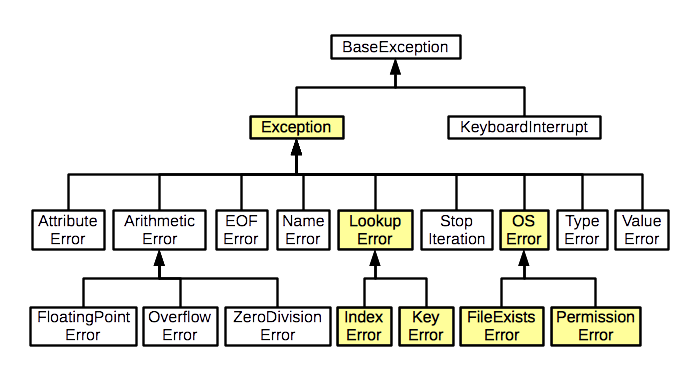

### Исключения

#### Иерархия

**BaseException** - главный класс, от которого наследуются все системные и пользовательские исключения и ошибки. У него 4 прямых наследника:

* **SystemExit** - произошел выход из программы;
* **KeyboardInterrupt** - пользователь нажал `Ctrl+C`;
* **GeneratorExit** - завершена работа генератора;
* **Exception** - родительский класс для прочих исключений.



* **IOError** - ошибка ввода-вывода;
* **ImportError** - ошибка импорта модуля;
* **IndexError** - обращение к несуществующему индексу последовательности;
* **OSError** - ошибка операционной системы;
* **SyntaxError** - синтаксическая ошибка;
* **TypeError** - ошибка типа данных, например, функция вызвана с неподходящим по типу аргументом;
* **ZeroDivisionError** - деление на ноль;
* **StopIteration** - итератор закончил работу.

#### Перехват и обработка

```python
try:
    a = 1
    b = 0
    c = a / b
except:
    print('Что-то пошло не так')
finally:
    print('Будет выполнено в любом случае')    
```

Расширенный вариант:

```python
try:
    a = input('Введите что-нибудь')
    b = int(a)
    print(b)
    c = 1 / b
except ValueError as e:
    print('Ошибка преобразования')
    print('Аргументы исключения:', e.args)
except ZeroDivisionError:
    print('Деление на ноль')
except Exception:
    print('Не знаю что, но что-то пошло не так')
finally:
    print('Будет выполнено в любом случае')            
```

#### Возбуждение исключения

```python
a = int(input('На что будем делить?'))
if a == 0:
    raise ZeroDivisionError('На ноль делить нельзя!')
```

#### Создание собственного класса исключения

```python
class MyException(Exception):

    def __init__(self, code: int, message: str):
        super().__init__(self)
        self.code = code
        self.message = message
        
# далее в коде

raise MyException(123, 'Ничего не понятно')       
```

